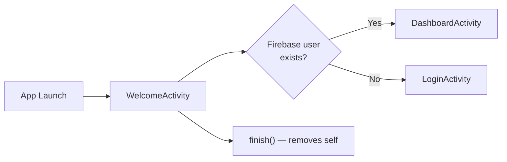
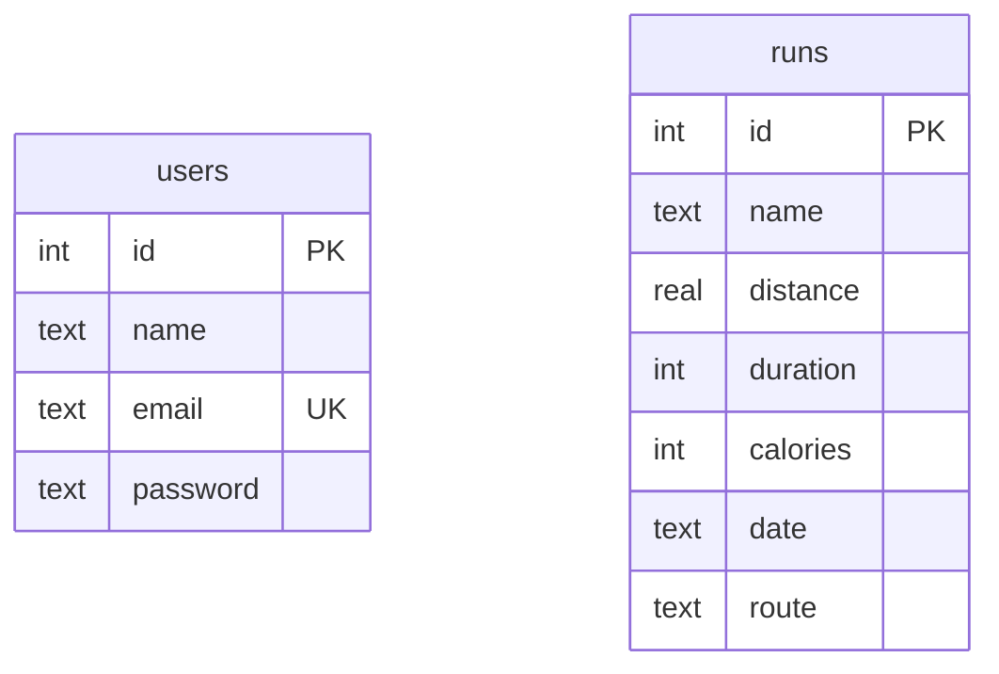
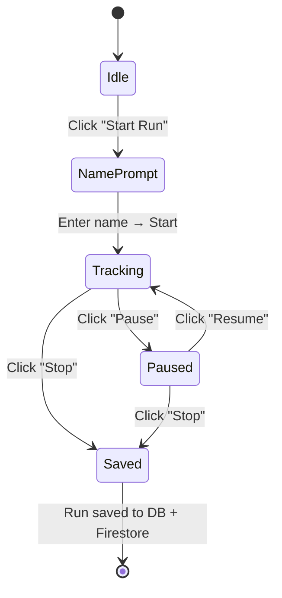
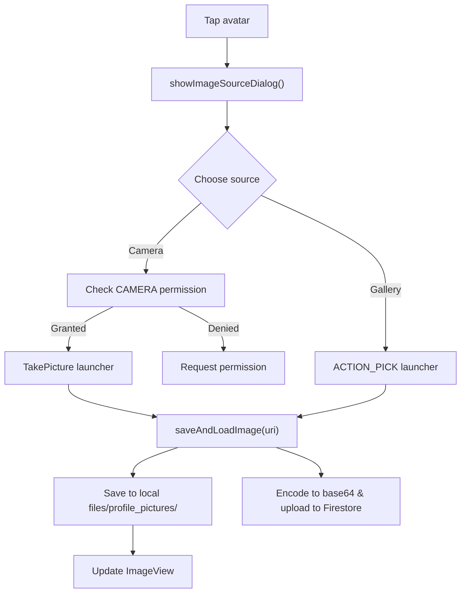
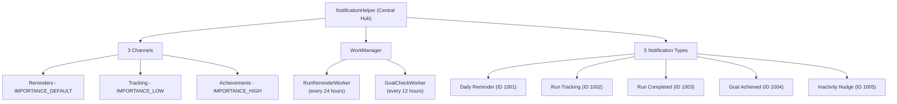
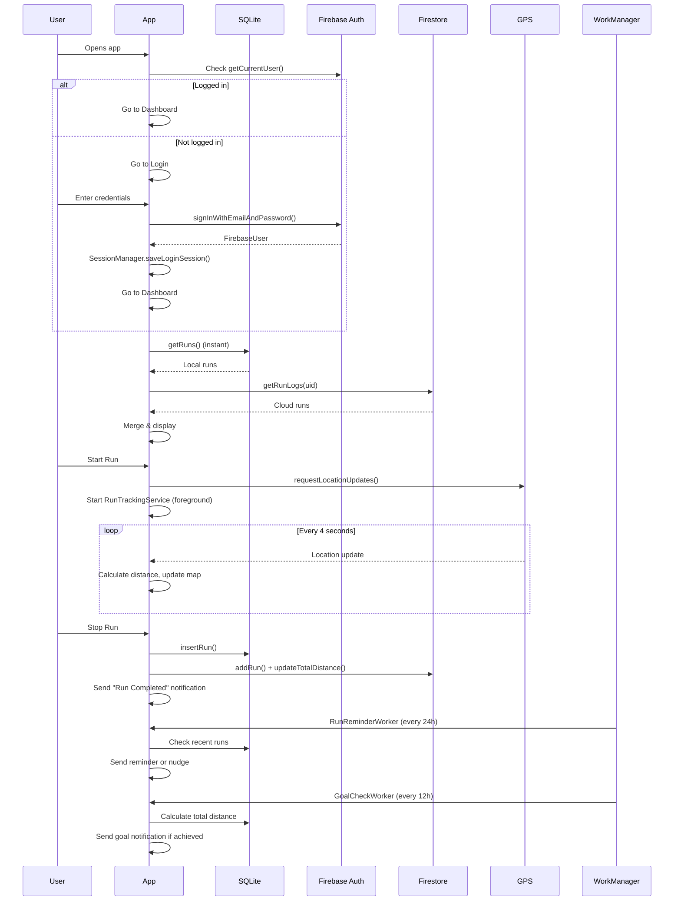

# MoveMate — Complete Project Flow Walkthrough

This document explains the **entire flow** of the MoveMate Android fitness tracker app, step by step, with code excerpts and reasoning for every block.

---

## Table of Contents

1. [High-Level Architecture](#1-high-level-architecture)
2. [Build Configuration](#2-build-configuration)
3. [AndroidManifest — Permissions & Components](#3-androidmanifest--permissions--components)
4. [App Launch Flow — WelcomeActivity](#4-app-launch-flow--welcomeactivity)
5. [Authentication — Login & Signup](#5-authentication--login--signup)
6. [Session Management — SharedPreferences](#6-session-management--sharedpreferences)
7. [Data Models](#7-data-models)
8. [Local Database — DBHelper (SQLite)](#8-local-database--dbhelper-sqlite)
9. [Cloud Sync — Firestore Repository](#9-cloud-sync--firestore-repository)
10. [Dashboard — Home Screen](#10-dashboard--home-screen)
11. [Run Tracking — MainActivity (GPS + Map)](#11-run-tracking--mainactivity-gps--map)
12. [Run Detail Screen](#12-run-detail-screen)
13. [Statistics Screen](#13-statistics-screen)
14. [Goals Management](#14-goals-management)
15. [Community Leaderboard](#15-community-leaderboard)
16. [Profile & Image Management](#16-profile--image-management)
17. [Notification System](#17-notification-system)
18. [Weather Integration](#18-weather-integration)
19. [Achievements](#19-achievements)
20. [Settings](#20-settings)
21. [Navigation Pattern](#21-navigation-pattern)
22. [Complete Data Flow Diagram](#22-complete-data-flow-diagram)

---

## 1. High-Level Architecture

```mermaid
graph TB
    subgraph Presentation["Presentation Layer (Activities)"]
        WA[WelcomeActivity]
        LA[LoginActivity]
        SA[SignupActivity]
        DA[DashboardActivity]
        MA[MainActivity - Run Tracker]
        STA[StatsActivity]
        CA[CommunityActivity]
        PA[ProfileActivity]
        GA[GoalsActivity]
        AA[AchievementsActivity]
        WEA[WeatherActivity]
        SET[SettingsActivity]
        RDA[RunDetailActivity]
    end

    subgraph Data["Data Layer"]
        SM[SessionManager - SharedPrefs]
        DB[DBHelper - SQLite]
        FR[FirestoreRepository]
    end

    subgraph Backend["Backend Services"]
        FA[Firebase Auth]
        FS[Firebase Firestore]
        OW[OpenWeatherMap API]
    end

    subgraph Notifications["Notification Layer"]
        NH[NotificationHelper]
        RTS[RunTrackingService]
        RRW[RunReminderWorker]
        GCW[GoalCheckWorker]
        BR[BootReceiver]
    end

    WA --> FA
    LA --> FA
    SA --> FA
    DA --> DB
    DA --> FR
    MA --> DB
    MA --> FR
    MA --> RTS
    STA --> DB
    STA --> FR
    CA --> FR
    PA --> DB
    PA --> SM
    GA --> DB
    AA --> DB
    WEA --> OW
    SET --> SM
    SET --> NH
    NH --> RRW
    NH --> GCW
    BR --> NH
```



**Pattern:** The app uses a hybrid **MVC/MVVM** approach where Activities act as Controllers, Models hold data, and the XML layouts serve as Views. Firebase handles cloud auth and data sync, while SQLite provides offline-first local storage.

---

## 2. Build Configuration

**File:** [build.gradle](file:///c:/Users/vinay/Downloads/Madl_miniproject/Madl_miniproject/app/build.gradle)

```gradle
plugins {
    id 'com.android.application'
    id 'com.google.gms.google-services'   // Firebase integration
}

android {
    namespace 'com.movemate'
    compileSdk 34                          // Target Android 14
    defaultConfig {
        applicationId "com.movemate"
        minSdk 24                          // Android 7.0+ (Nougat)
        targetSdk 34
        // Weather API key placeholder
        buildConfigField "String", "OPEN_WEATHER_API_KEY", '"YOUR_API_KEY_HERE"'
    }
    compileOptions {
        sourceCompatibility JavaVersion.VERSION_17
        targetCompatibility JavaVersion.VERSION_17
    }
    buildFeatures {
        viewBinding true                   // Type-safe view access
        buildConfig true                   // Access BuildConfig fields
    }
}
```

### Key Dependencies & Their Roles

| Library | Purpose |
|---------|---------|
| `firebase-auth` | Email/password user authentication |
| `firebase-firestore` | Cloud database for run logs & leaderboards |
| `play-services-location` | Google's Fused Location Provider for GPS |
| `osmdroid` | Open-source map rendering (OpenStreetMap) |
| `MPAndroidChart` | Bar & Pie chart visualization |
| `retrofit2` + `gson` | HTTP client for OpenWeatherMap API |
| `picasso` | Image loading (weather icons) |
| `work-runtime` | WorkManager for periodic background tasks |

**Reasoning:** The project avoids Google Maps (which needs a paid API key) and uses `osmdroid` instead — an open-source alternative that uses OpenStreetMap tiles for free.

---

## 3. AndroidManifest — Permissions & Components

**File:** [AndroidManifest.xml](file:///c:/Users/vinay/Downloads/Madl_miniproject/Madl_miniproject/app/src/main/AndroidManifest.xml)

```xml
<!-- Location for GPS tracking during runs -->
<uses-permission android:name="android.permission.ACCESS_FINE_LOCATION" />
<uses-permission android:name="android.permission.ACCESS_COARSE_LOCATION" />

<!-- Internet for Firestore, maps, weather API -->
<uses-permission android:name="android.permission.INTERNET" />

<!-- Android 13+ notification permission -->
<uses-permission android:name="android.permission.POST_NOTIFICATIONS" />

<!-- Foreground service during active runs -->
<uses-permission android:name="android.permission.FOREGROUND_SERVICE" />
<uses-permission android:name="android.permission.FOREGROUND_SERVICE_LOCATION" />

<!-- Re-schedule notifications after reboot -->
<uses-permission android:name="android.permission.RECEIVE_BOOT_COMPLETED" />

<!-- Camera & gallery for profile pictures -->
<uses-permission android:name="android.permission.CAMERA" />
<uses-permission android:name="android.permission.READ_EXTERNAL_STORAGE" />
<uses-permission android:name="android.permission.READ_MEDIA_IMAGES" />
```

### Registered Components

| Component | Type | Purpose |
|-----------|------|---------|
| `WelcomeActivity` | **Launcher** | Entry point — checks auth state |
| `RunTrackingService` | **Foreground Service** | Persistent notification during run |
| `BootReceiver` | **BroadcastReceiver** | Re-schedules workers on device reboot |
| `FileProvider` | **ContentProvider** | Secure URI sharing for camera photos |

**Reasoning:** `WelcomeActivity` is the LAUNCHER activity (the first screen the OS opens). It's exported=true so the Android launcher can invoke it. All others are exported=false for security.

---

## 4. App Launch Flow — WelcomeActivity

**File:** [WelcomeActivity.java](file:///c:/Users/vinay/Downloads/Madl_miniproject/Madl_miniproject/app/src/main/java/com/movemate/WelcomeActivity.java)

```java
public class WelcomeActivity extends AppCompatActivity {
    @Override
    protected void onCreate(Bundle savedInstanceState) {
        super.onCreate(savedInstanceState);
        setContentView(R.layout.activity_welcome);

        // Check if user is already logged in via Firebase
        FirebaseUser user = FirebaseAuth.getInstance().getCurrentUser();
        if (user != null) {
            startActivity(new Intent(this, DashboardActivity.class));  // → Dashboard
        } else {
            startActivity(new Intent(this, LoginActivity.class));      // → Login
        }
        finish();  // Remove from back stack
    }
}
```

### Flow Diagram



**Reasoning:** This is a **splash/router** pattern. It shows the welcome layout briefly, then immediately redirects based on authentication state. `finish()` removes it from the back stack so pressing Back won't return here.

---

## 5. Authentication — Login & Signup

### 5a. LoginActivity

**File:** [LoginActivity.java](file:///c:/Users/vinay/Downloads/Madl_miniproject/Madl_miniproject/app/src/main/java/com/movemate/LoginActivity.java)

```java
// Validate inputs
if (TextUtils.isEmpty(email) || TextUtils.isEmpty(password)) {
    Toast.makeText(this, "Email and password are required", ...).show();
    return;
}
if (!Patterns.EMAIL_ADDRESS.matcher(email).matches()) {
    Toast.makeText(this, "Invalid email format", ...).show();
    return;
}

// Firebase Authentication
auth.signInWithEmailAndPassword(email, password)
    .addOnCompleteListener(this, task -> {
        if (task.isSuccessful()) {
            FirebaseUser user = auth.getCurrentUser();
            // Save session locally for offline access
            SessionManager.saveLoginSession(LoginActivity.this, display, email);
            startActivity(new Intent(LoginActivity.this, DashboardActivity.class));
            finish();
        } else {
            Toast.makeText(..., "Invalid email or password", ...).show();
        }
    });
```

**Reasoning:**
- **Client-side validation** runs first (empty check, email regex) to avoid unnecessary network calls.
- `signInWithEmailAndPassword()` sends credentials to Firebase Auth, which returns a `FirebaseUser` on success.
- `SessionManager.saveLoginSession()` caches the name/email in `SharedPreferences` for offline display.

### 5b. SignupActivity

**File:** [SignupActivity.java](file:///c:/Users/vinay/Downloads/Madl_miniproject/Madl_miniproject/app/src/main/java/com/movemate/SignupActivity.java)

```java
auth.createUserWithEmailAndPassword(email, password)
    .addOnCompleteListener(this, task -> {
        if (task.isSuccessful()) {
            FirebaseUser user = auth.getCurrentUser();
            
            // 1. Set display name on Firebase Auth profile
            user.updateProfile(new UserProfileChangeRequest.Builder()
                .setDisplayName(name).build());
            
            // 2. Create Firestore user document
            firestoreRepo.createUserIfNotExists(user.getUid(), name);
            
            // 3. Save local session
            SessionManager.saveLoginSession(this, name, email);
            
            // 4. Navigate to Dashboard
            startActivity(new Intent(this, DashboardActivity.class));
            finish();
        }
    });
```

**Reasoning:** Signup does **4 things in sequence:**
1. Creates the Firebase Auth account
2. Sets `displayName` on the Auth profile (so other screens can read it)
3. Creates a Firestore document at `users/{uid}` with name + totalDistance=0
4. Saves session locally and navigates to dashboard

---

## 6. Session Management — SharedPreferences

**File:** [SessionManager.java](file:///c:/Users/vinay/Downloads/Madl_miniproject/Madl_miniproject/app/src/main/java/com/movemate/SessionManager.java)

```java
public class SessionManager {
    private static final String PREF_NAME = "movemate_prefs";

    public static void saveLoginSession(Context context, String name, String email) {
        prefs.edit()
            .putBoolean("logged_in", true)
            .putString("name", name)
            .putString("email", email)
            .apply();
    }

    public static boolean isUserLoggedIn(Context context) { ... }
    public static String getUserName(Context context) { ... }
    public static String getUserEmail(Context context) { ... }

    public static void logoutUser(Context context) {
        prefs.edit().clear().apply();  // Wipe all local session data
    }
}
```

**Reasoning:** `SharedPreferences` is Android's lightweight key-value store. It acts as a **local cache** for user identity so the app can display the user's name on the dashboard even without network access. `apply()` writes asynchronously (non-blocking).

---

## 7. Data Models

### 7a. RunModel (Local)

**File:** [RunModel.java](file:///c:/Users/vinay/Downloads/Madl_miniproject/Madl_miniproject/app/src/main/java/com/movemate/RunModel.java)

```java
public class RunModel {
    private final int id;           // SQLite auto-increment ID
    private final String name;      // "Morning Run" etc.
    private final double distanceKm;
    private final long durationMs;  // In milliseconds
    private final int calories;
    private final String date;      // "yyyy-MM-dd"
    private final String routeJson; // JSON array of {lat, lng} points
}
```

### 7b. RunLogModel (Firestore)

**File:** [RunLogModel.java](file:///c:/Users/vinay/Downloads/Madl_miniproject/Madl_miniproject/app/src/main/java/com/movemate/firestore/RunLogModel.java)

```java
public class RunLogModel {
    private double distance;      // km
    private int steps;
    private int calories;
    private long duration;        // In SECONDS (not ms!)
    private Timestamp timestamp;  // Firebase server timestamp

    public RunLogModel() {}       // Required for Firestore deserialization
}
```

### 7c. UserModel (Firestore)

**File:** [UserModel.java](file:///c:/Users/vinay/Downloads/Madl_miniproject/Madl_miniproject/app/src/main/java/com/movemate/firestore/UserModel.java)

```java
public class UserModel {
    private String uid;
    private String name;
    private double totalDistance;   // Cumulative km across all runs
    private String photoBase64;    // Profile photo encoded as base64
}
```

**Reasoning:** Two separate run models exist because:
- `RunModel` stores data locally with **millisecond durations** and **route JSON**
- `RunLogModel` stores cloud data with **second durations** and **server timestamps** (Firestore's `Timestamp` type auto-sets when writing)

---

## 8. Local Database — DBHelper (SQLite)

**File:** [DBHelper.java](file:///c:/Users/vinay/Downloads/Madl_miniproject/Madl_miniproject/app/src/main/java/com/movemate/DBHelper.java)

```java
public class DBHelper extends SQLiteOpenHelper {
    private static final String DB_NAME = "movemate.db";
    private static final int DB_VERSION = 3;
```

### Tables



### Key Operations

| Method | SQL Operation | Purpose |
|--------|--------------|---------|
| `insertUser()` | INSERT INTO users | Register new user locally |
| `checkUser()` | SELECT WHERE email=? AND password=? | Validate login |
| `insertRun()` | INSERT INTO runs | Save completed run |
| `getRuns()` | SELECT * ORDER BY id DESC | Load all runs (newest first) |
| `deleteRun()` | DELETE WHERE id=? | Remove a run |

**Reasoning:** SQLite provides **offline-first** data persistence. Even without internet, users can log runs and view history. The `onUpgrade()` method drops and recreates tables — acceptable during development but would need migration logic in production.

---

## 9. Cloud Sync — Firestore Repository

**File:** [FirestoreRepository.java](file:///c:/Users/vinay/Downloads/Madl_miniproject/Madl_miniproject/app/src/main/java/com/movemate/firestore/FirestoreRepository.java)

### Firestore Data Structure

```
Firestore Root
└── users (collection)
    └── {uid} (document)
        ├── name: "Rahul Sharma"
        ├── totalDistance: 45.7
        ├── photoBase64: "..." (optional)
        └── runs (sub-collection)
            └── {auto-id} (document)
                ├── distance: 5.2
                ├── steps: 6800
                ├── calories: 312
                ├── duration: 1860 (seconds)
                └── timestamp: <server timestamp>
```

### Key Methods

```java
// 1. Create user doc if it doesn't exist (idempotent)
public Task<Void> createUserIfNotExists(String uid, String name) {
    return userRef.get().continueWithTask(task -> {
        if (snapshot.exists()) return Tasks.forResult(null); // Already exists
        Map<String, Object> data = new HashMap<>();
        data.put("name", name);
        data.put("totalDistance", 0.0);
        return userRef.set(data);
    });
}

// 2. Add a run to the user's sub-collection
public Task<DocumentReference> addRun(String uid, RunLogModel run) {
    data.put("timestamp", FieldValue.serverTimestamp()); // Server sets time
    return users.document(uid).collection("runs").add(data);
}

// 3. Atomically increment totalDistance
public Task<Void> updateTotalDistance(String uid, double distanceToAdd) {
    return users.document(uid)
        .update("totalDistance", FieldValue.increment(distanceToAdd));
}

// 4. Real-time leaderboard listener
public ListenerRegistration listenToLeaderboard(LeaderboardListener listener) {
    return users.orderBy("totalDistance", Query.Direction.DESCENDING)
        .addSnapshotListener((value, error) -> {
            listener.onUpdate(mapUsers(value));
        });
}
```

**Reasoning:**
- `FieldValue.serverTimestamp()` ensures timestamps are consistent across timezones
- `FieldValue.increment()` is an **atomic operation** — safe even with concurrent writes
- `addSnapshotListener()` provides **real-time updates** — the leaderboard updates live without manual refresh
- `continueWithTask()` chains asynchronous Firestore operations

---

## 10. Dashboard — Home Screen

**File:** [DashboardActivity.java](file:///c:/Users/vinay/Downloads/Madl_miniproject/Madl_miniproject/app/src/main/java/com/movemate/DashboardActivity.java) (683 lines — the largest file)

### Initialization Flow

```java
@Override
protected void onCreate(Bundle savedInstanceState) {
    // 1. Setup notification infrastructure
    NotificationHelper.createChannels(this);
    if (NotificationHelper.areNotificationsEnabled(this)) {
        NotificationHelper.scheduleAllWorkers(this);
    }

    // 2. Initialize data sources
    dbHelper = new DBHelper(this);
    firestoreRepo = new FirestoreRepository();

    // 3. Setup gesture detector (swipe navigation)
    gestureDetector = new GestureDetector(this, new DashboardGestureListener());

    // 4. Bind all UI views
    bindViews();

    // 5. Setup swipe-to-refresh
    swipeRefreshLayout.setOnRefreshListener(() -> refreshAllData());

    // 6. Time-based greeting ("Good Morning, Vinay 👋")
    setupGreeting();

    // 7. Setup RecyclerView for recent runs
    runAdapter = new RunAdapter(runs, ...);
    recentRecycler.setAdapter(runAdapter);

    // 8. Bottom navigation bar
    bottomNav.setOnItemSelectedListener(item -> { ... });

    // 9. FAB → Start a new run
    startRunFab.setOnClickListener(v -> startActivity(..., MainActivity.class));

    // 10. Load all data
    refreshAllData();
}
```

### Data Refresh Strategy (Offline-First)

```java
private void refreshAllData() {
    // STEP 1: Show local data IMMEDIATELY
    runs.clear();
    runs.addAll(dbHelper.getRuns());
    runAdapter.notifyDataSetChanged();
    updateDashboardUI();

    // STEP 2: Fetch cloud data in background
    firestoreRepo.getRunLogs(user.getUid(), new RunLogsCallback() {
        @Override
        public void onSuccess(List<RunLogModel> firestoreRuns) {
            // Convert cloud model → local model
            // Merge: avoid duplicates by matching distance+date+calories
            for (RunModel cloudRun : cloudRuns) {
                boolean alreadyLocal = false;
                for (RunModel localRun : localRuns) {
                    if (Math.abs(cloudRun.getDistanceKm() - localRun.getDistanceKm()) < 0.01
                        && cloudRun.getDate().equals(localRun.getDate())) {
                        alreadyLocal = true; break;
                    }
                }
                if (!alreadyLocal) merged.add(cloudRun);
            }
            // Update UI with merged data
            updateDashboardUI();
        }
    });
}
```

**Reasoning:** This is an **offline-first** pattern:
1. Local SQLite data loads instantly (no network delay)
2. Firestore data loads asynchronously and **merges** with local data
3. Duplicate detection prevents showing the same run twice

### Charts

The dashboard includes two charts powered by MPAndroidChart:

**Bar Chart** — Weekly distances (last 7 days):
```java
private void setupBarChart() {
    float[] weeklyDistances = computeWeeklyDistances(runs); // [Mon, Tue, ..., Sun]
    BarDataSet dataSet = new BarDataSet(entries, "Distance (km)");
    dataSet.setColor(0xFF00E5FF); // Neon cyan
    dashboardBarChart.animateY(800);
}
```

**Pie Chart** — Calorie breakdown of last 5 runs:
```java
private void setupPieChart() {
    int count = Math.min(runs.size(), 5);
    for (int i = 0; i < count; i++) {
        entries.add(new PieEntry(runs.get(i).getCalories(), label));
    }
    dashboardPieChart.setHoleColor(0xFF171B28); // Dark hole center
    dashboardPieChart.setCenterText("Calories");
}
```

### Animated Stats
```java
private void animateTextValue(TextView textView, float from, float to, boolean isDecimal) {
    ValueAnimator animator = ValueAnimator.ofFloat(from, to);
    animator.setDuration(1000);
    animator.setInterpolator(new AccelerateDecelerateInterpolator());
    animator.addUpdateListener(animation -> {
        float val = (float) animation.getAnimatedValue();
        textView.setText(isDecimal ? String.format("%.1f", val) : String.valueOf((int) val));
    });
    animator.start();
}
```

**Reasoning:** `ValueAnimator` smoothly increments the displayed number from 0 to the real value over 1 second. This creates a polished "count-up" effect when the dashboard loads.

---

## 11. Run Tracking — MainActivity (GPS + Map)

**File:** [MainActivity.java](file:///c:/Users/vinay/Downloads/Madl_miniproject/Madl_miniproject/app/src/main/java/com/movemate/MainActivity.java) (473 lines)

### Run Lifecycle



### Map Setup (osmdroid)

```java
private void configureMapCache() {
    File basePath = new File(getCacheDir(), "osmdroid");
    config.setOsmdroidBasePath(basePath);
    config.setTileFileSystemCacheMaxBytes(80L * 1024L * 1024L);  // 80MB tile cache
}

// In onCreate:
map.setTileSource(TileSourceFactory.MAPNIK);    // OpenStreetMap tiles
map.setMultiTouchControls(true);                 // Pinch-to-zoom
map.getController().setZoom(17.0);               // Street-level zoom

// Route polyline (green trail)
routeLine = new Polyline();
routeLine.setColor(0xFF76FF03);                  // Bright green
routeLine.setWidth(10f);
map.getOverlays().add(routeLine);
```

### GPS Location Tracking

```java
private void startLocationUpdates() {
    LocationRequest request = LocationRequest.create()
        .setInterval(4000)              // Update every 4 seconds
        .setFastestInterval(2000)       // Accept updates as fast as 2 sec
        .setPriority(LocationRequest.PRIORITY_HIGH_ACCURACY);  // Use GPS
    fusedLocationClient.requestLocationUpdates(request, locationCallback, getMainLooper());
}
```

### Distance Calculation

```java
private void onLocationUpdate(Location location) {
    if (!isTracking || isPaused) return;

    GeoPoint point = new GeoPoint(location.getLatitude(), location.getLongitude());
    if (!routePoints.isEmpty()) {
        GeoPoint last = routePoints.get(routePoints.size() - 1);
        float[] results = new float[1];
        // Haversine distance between consecutive GPS points
        Location.distanceBetween(last.getLatitude(), last.getLongitude(),
            point.getLatitude(), point.getLongitude(), results);
        distanceMeters += results[0];  // Accumulate
    }
    routePoints.add(point);
    updatePolyline();   // Redraw route on map
    updateStatsUi();    // Update distance, pace, calories display
    map.getController().animateTo(point);  // Center map on current position
}
```

**Reasoning:** `Location.distanceBetween()` uses the **Haversine formula** internally to compute great-circle distance between two lat/lng points on Earth's surface. This is accurate to a few meters, which is sufficient for fitness tracking.

### Saving a Completed Run

```java
private void stopRun() {
    // 1. Calculate final stats
    long durationMs = SystemClock.elapsedRealtime() - startTimeMs;
    double distanceKm = distanceMeters / 1000.0;
    int calories = (int) (distanceKm * 60);  // ~60 kcal/km formula

    // 2. Save to local SQLite
    saveRun(currentRunName, distanceKm, durationMs, calories, routePoints);

    // 3. Push to Firestore cloud
    pushRunToFirestore(distanceKm, durationMs, calories);

    // 4. Stop foreground tracking service
    Intent serviceIntent = new Intent(this, RunTrackingService.class);
    serviceIntent.setAction(RunTrackingService.ACTION_STOP);
    startService(serviceIntent);

    // 5. Send "Run Completed" notification
    NotificationHelper.notify(this, ID_RUN_COMPLETED,
        NotificationHelper.buildRunCompleted(this, distStr, durStr, calories));
}
```

### Route Serialization

```java
private void saveRun(..., List<GeoPoint> coords) {
    JSONArray array = new JSONArray();
    for (GeoPoint latLng : coords) {
        JSONObject obj = new JSONObject();
        obj.put("lat", latLng.getLatitude());
        obj.put("lng", latLng.getLongitude());
        array.put(obj);
    }
    String routeJson = array.toString();
    dbHelper.insertRun(name, distanceKm, durationMs, calories, date, routeJson);
}
```

**Reasoning:** The GPS route is stored as a **JSON array of lat/lng objects** in SQLite. This is a pragmatic choice — it avoids adding another table with foreign keys while keeping route data self-contained and easy to parse for map replay.

---

## 12. Run Detail Screen

**File:** [RunDetailActivity.java](file:///c:/Users/vinay/Downloads/Madl_miniproject/Madl_miniproject/app/src/main/java/com/movemate/RunDetailActivity.java)

When a user taps a run in the dashboard list, the `RunAdapter` passes all data via Intent extras:

```java
// In RunAdapter:
holder.itemView.setOnClickListener(v -> {
    Intent intent = new Intent(v.getContext(), RunDetailActivity.class);
    intent.putExtra("name", run.getName());
    intent.putExtra("distance", run.getDistanceKm());
    intent.putExtra("duration", run.getDurationMs());
    intent.putExtra("calories", run.getCalories());
    intent.putExtra("date", run.getDate());
    intent.putExtra("route", run.getRouteJson());
    v.getContext().startActivity(intent);
});
```

RunDetailActivity renders:
- All run metrics (distance, time, pace, calories)
- A **map with the route polyline** drawn from the saved JSON

---

## 13. Statistics Screen

**File:** [StatsActivity.java](file:///c:/Users/vinay/Downloads/Madl_miniproject/Madl_miniproject/app/src/main/java/com/movemate/StatsActivity.java)

Shows:
1. **Weekly Bar Chart** — distance per day for last 7 days
2. **Personal Bests** — a RecyclerView showing:
   - Total runs
   - Total distance
   - Farthest single run
   - Fastest pace (min/km)
   - Total calories

```java
// Finding fastest pace
for (RunModel run : runs) {
    if (run.getDistanceKm() > 0) {
        double pace = (run.getDurationMs() / 1000.0 / 60.0) / run.getDistanceKm();
        if (pace < fastestPace) {
            fastestPace = pace;
        }
    }
}
```

**Reasoning:** Pace formula = `(time in minutes) / (distance in km)`. Lower pace = faster running. A 5 min/km pace means you complete 1 km every 5 minutes.

---

## 14. Goals Management

**File:** [GoalsActivity.java](file:///c:/Users/vinay/Downloads/Madl_miniproject/Madl_miniproject/app/src/main/java/com/movemate/GoalsActivity.java)

```java
// Goals stored in SharedPreferences
SharedPreferences prefs = getSharedPreferences("goals_prefs", MODE_PRIVATE);
float weeklyGoal = prefs.getFloat("weekly_goal", 20f);   // Default: 20 km/week
float monthlyGoal = prefs.getFloat("monthly_goal", 80f);  // Default: 80 km/month

// On save: immediately trigger goal check
saveButton.setOnClickListener(v -> {
    prefs.edit().putFloat("weekly_goal", w).putFloat("monthly_goal", m).apply();
    // Fire a one-time WorkManager task to check if goals are met NOW
    WorkManager.getInstance(this)
        .enqueue(new OneTimeWorkRequest.Builder(GoalCheckWorker.class).build());
});
```

**Reasoning:** Goals use `SharedPreferences` (not SQLite) because they're simple key-value settings, not relational data. When goals are saved, an immediate `GoalCheckWorker` fires to check if the user has already met the new target and sends a notification.

---

## 15. Community Leaderboard

**File:** [CommunityActivity.java](file:///c:/Users/vinay/Downloads/Madl_miniproject/Madl_miniproject/app/src/main/java/com/movemate/CommunityActivity.java)

```java
// Real-time leaderboard listener
leaderboardListener = firestoreRepo.listenToLeaderboard(
    new FirestoreRepository.LeaderboardListener() {
        @Override
        public void onUpdate(List<UserModel> users) {
            leaderboardData.clear();
            leaderboardData.addAll(users);
            adapter.notifyDataSetChanged();
        }
    }
);
```

```java
// Cleanup: remove listener when activity is destroyed
@Override
protected void onDestroy() {
    super.onDestroy();
    if (leaderboardListener != null) {
        leaderboardListener.remove();  // Prevent memory leaks
    }
}
```

### Avatar Resolution

For each leaderboard entry:
1. Try loading `photoBase64` from Firestore → decode to bitmap
2. If no photo, check if it's the current user → load local profile picture
3. Fallback → show first letter of name with a color based on `name.hashCode()`

**Reasoning:** The `addSnapshotListener()` approach means the leaderboard updates **in real-time** — if another user completes a run while you're viewing the leaderboard, the rankings update automatically without a refresh.

---

## 16. Profile & Image Management

**File:** [ProfileActivity.java](file:///c:/Users/vinay/Downloads/Madl_miniproject/Madl_miniproject/app/src/main/java/com/movemate/ProfileActivity.java)

### Profile Photo Flow



### ImageUtils

**File:** [ImageUtils.java](file:///c:/Users/vinay/Downloads/Madl_miniproject/Madl_miniproject/app/src/main/java/com/movemate/ImageUtils.java)

```java
// Creates user-specific file path
public static File getProfileImageFile(Context context) {
    String safeEmail = email.replace("@", "_at_").replace(".", "_dot_");
    return new File(dir, "profile_" + safeEmail + ".jpg");
    // e.g., profile_vinay_at_gmail_dot_com.jpg
}
```

**Reasoning:** Profile images are stored per-user-email. The email is sanitized (`@` → `_at_`) because filesystem paths cannot contain special characters. This allows multiple accounts on the same device to have separate profile pictures.

### Logout

```java
logoutButton.setOnClickListener(v -> {
    SessionManager.logoutUser(this);           // Clear SharedPreferences
    FirebaseAuth.getInstance().signOut();       // Sign out of Firebase
    Intent intent = new Intent(this, LoginActivity.class);
    intent.addFlags(Intent.FLAG_ACTIVITY_CLEAR_TOP | Intent.FLAG_ACTIVITY_NEW_TASK);
    startActivity(intent);
    finishAffinity();                           // Kill entire activity stack
});
```

**Reasoning:** `finishAffinity()` closes ALL activities in the task, not just the current one. Combined with `FLAG_ACTIVITY_CLEAR_TOP`, this ensures the user can't press Back to return to authenticated screens after logging out.

---

## 17. Notification System

### Architecture



### NotificationHelper — Central Hub

**File:** [NotificationHelper.java](file:///c:/Users/vinay/Downloads/Madl_miniproject/Madl_miniproject/app/src/main/java/com/movemate/notification/NotificationHelper.java)

```java
// Create channels (safe to call multiple times)
public static void createChannels(Context context) {
    if (Build.VERSION.SDK_INT < Build.VERSION_CODES.O) return;
    // Reminders, Tracking, Achievements channels
}

// Respect user preference before sending
public static void notify(Context context, int id, Notification notification) {
    if (!areNotificationsEnabled(context)) return;  // Check SharedPrefs toggle
    if (Build.VERSION.SDK_INT >= TIRAMISU) {
        if (checkSelfPermission(...POST_NOTIFICATIONS) != GRANTED) return;
    }
    NotificationManagerCompat.from(context).notify(id, notification);
}

// Schedule periodic workers
public static void scheduleAllWorkers(Context context) {
    // Daily reminder: every 24h, initial delay 1h
    new PeriodicWorkRequest.Builder(RunReminderWorker.class, 24, TimeUnit.HOURS)
        .setInitialDelay(1, TimeUnit.HOURS).build();

    // Goal check: every 12h, initial delay 30min
    new PeriodicWorkRequest.Builder(GoalCheckWorker.class, 12, TimeUnit.HOURS)
        .setInitialDelay(30, TimeUnit.MINUTES).build();
}
```

### RunTrackingService — Foreground Service

**File:** [RunTrackingService.java](file:///c:/Users/vinay/Downloads/Madl_miniproject/Madl_miniproject/app/src/main/java/com/movemate/notification/RunTrackingService.java)

```java
// Three actions: START, UPDATE, STOP
switch (intent.getAction()) {
    case ACTION_START:
        startForeground(ID_RUN_TRACKING,
            buildTrackingNotification(this, "0.00 km", "00:00:00"));
        break;
    case ACTION_UPDATE:
        // Refresh the persistent notification with current distance/duration
        Notification updated = buildTrackingNotification(this, distance, duration);
        NotificationManagerCompat.from(this).notify(ID_RUN_TRACKING, updated);
        break;
    case ACTION_STOP:
        stopForeground(true);
        stopSelf();
        break;
}
```

**Reasoning:** Android requires a **foreground service** for continuous GPS tracking. Without it, the OS would kill the app in the background. The persistent notification tells the user "a run is in progress" and lets them tap to return to the app.

### RunReminderWorker — Daily Motivation

**File:** [RunReminderWorker.java](file:///c:/Users/vinay/Downloads/Madl_miniproject/Madl_miniproject/app/src/main/java/com/movemate/notification/RunReminderWorker.java)

```java
public Result doWork() {
    if (hasRecentRuns(context)) {
        // Active user → motivational message
        notify("Time to Run! 🏃", randomMotivationalMessage);
    } else {
        // Inactive 2+ days → nudge
        notify("We miss you! 👋", "You haven't logged a run recently.");
    }
    return Result.success();
}

private boolean hasRecentRuns(Context context) {
    // Query SQLite: SELECT COUNT(*) FROM runs WHERE date >= (2 days ago)
    return count > 0;
}
```

### GoalCheckWorker — Goal Notifications

**File:** [GoalCheckWorker.java](file:///c:/Users/vinay/Downloads/Madl_miniproject/Madl_miniproject/app/src/main/java/com/movemate/notification/GoalCheckWorker.java)

```java
// Prevent duplicate notifications using "notified" SharedPreferences
float lastNotifiedWeekly = notifiedPrefs.getFloat("weekly_notified", -1f);
if (totalDistance >= weeklyGoal && lastNotifiedWeekly < weeklyGoal) {
    notify("Weekly Goal Achieved! 🏆", distance);
    notifiedPrefs.edit().putFloat("weekly_notified", weeklyGoal).apply();
}
```

**Reasoning:** The `notifiedPrefs` pattern prevents spamming. Once a "weekly goal achieved" notification is sent for a 20km goal, it won't fire again until the user changes the goal to a different value.

### BootReceiver — Survive Reboots

**File:** [BootReceiver.java](file:///c:/Users/vinay/Downloads/Madl_miniproject/Madl_miniproject/app/src/main/java/com/movemate/notification/BootReceiver.java)

```java
public void onReceive(Context context, Intent intent) {
    if (Intent.ACTION_BOOT_COMPLETED.equals(intent.getAction())) {
        NotificationHelper.createChannels(context);
        NotificationHelper.scheduleAllWorkers(context);
    }
}
```

**Reasoning:** WorkManager tasks are killed on device reboot. The `BootReceiver` re-registers them when the phone starts up, ensuring reminders continue working.

---

## 18. Weather Integration

**File:** [WeatherActivity.java](file:///c:/Users/vinay/Downloads/Madl_miniproject/Madl_miniproject/app/src/main/java/com/movemate/WeatherActivity.java)

```java
// Retrofit client for OpenWeatherMap API
Retrofit retrofit = new Retrofit.Builder()
    .baseUrl("https://api.openweathermap.org/")
    .addConverterFactory(GsonConverterFactory.create())
    .build();

// API interface
interface WeatherService {
    @GET("data/2.5/weather")
    Call<WeatherResponse> current(
        @Query("q") String city,
        @Query("units") String units,    // "metric" for Celsius
        @Query("appid") String apiKey
    );
}

// Display weather
tempText.setText(String.format("%.0f°C", w.main.temp));
windText.setText(String.format("%.1f m/s", w.wind.speed));
humidityText.setText(String.format("%d%%", w.main.humidity));

// Load weather icon from OpenWeatherMap CDN
Picasso.get()
    .load("https://openweathermap.org/img/wn/" + icon + "@2x.png")
    .into(weatherIcon);
```

**Reasoning:** Retrofit provides a type-safe HTTP client. `GsonConverterFactory` auto-converts the JSON response into `WeatherResponse` Java objects. Picasso handles image downloading and caching.

---

## 19. Achievements

**File:** [AchievementsActivity.java](file:///c:/Users/vinay/Downloads/Madl_miniproject/Madl_miniproject/app/src/main/java/com/movemate/AchievementsActivity.java)

```java
private List<Achievement> buildAchievements() {
    List<RunModel> runs = dbHelper.getRuns();
    double totalDistance = 0;
    for (RunModel r : runs) totalDistance += r.getDistance();

    List<Achievement> list = new ArrayList<>();
    list.add(new Achievement("First Run", totalRuns >= 1));
    list.add(new Achievement("10 km total", totalDistance >= 10));
    list.add(new Achievement("100 km milestone", totalDistance >= 100));
    list.add(new Achievement("7-day streak", totalRuns >= 7));
    return list;
}
```

Displayed in a **2-column GridLayout** with locked achievements at 50% opacity.

---

## 20. Settings

**File:** [SettingsActivity.java](file:///c:/Users/vinay/Downloads/Madl_miniproject/Madl_miniproject/app/src/main/java/com/movemate/SettingsActivity.java)

| Toggle | Key | Effect |
|--------|-----|--------|
| Dark Mode | `dark_mode` | `AppCompatDelegate.setDefaultNightMode()` |
| Units (km) | `units_km` | Toggle km/miles display |
| Notifications | `notify` | `scheduleAllWorkers()` / `cancelAllWorkers()` |

```java
notifySwitch.setOnCheckedChangeListener((b, checked) -> {
    prefs.edit().putBoolean("notify", checked).apply();
    if (checked) {
        NotificationHelper.scheduleAllWorkers(this);   // Enable
    } else {
        NotificationHelper.cancelAllWorkers(this);      // Disable
    }
});
```

---

## 21. Navigation Pattern

All main screens share a **BottomNavigationView** with 5 tabs:

| Tab | Icon | Destination |
|-----|------|-------------|
| Home | 🏠 | DashboardActivity |
| Stats | 📊 | StatsActivity |
| Run | 🏃 | MainActivity |
| Community | 👥 | CommunityActivity |
| Profile | 👤 | ProfileActivity |

The Dashboard also supports **gesture navigation:**
- **Swipe right** → Back
- **Swipe left** → Stats
- **Double tap** → Start Run

---

## 22. Complete Data Flow Diagram



---

> **Summary:** MoveMate follows an **offline-first, dual-storage** architecture. Every run is saved to SQLite first (instant, no network needed), then pushed to Firestore (for cloud sync and leaderboards). Firebase Auth handles user identity, WorkManager handles background notifications, and osmdroid provides free map rendering.
